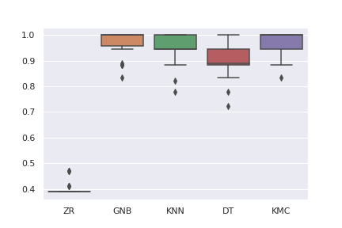

# Basic classifiers applied into Wine dataset
### First Work -  Artificial Intelligence and Smart Systems
#### **Author:** Igor Varejão

Machine Learning is taking an important role nowadays, with models been
applied to a vary of tasks such as weather prediction, credit analysis and so
forth. Therefore, it becomes a priority to study the algorithms on this area and
evaluate theirs performance. This repo aims at the study of basics algorithms
on classifications problems as also a new one, the KMC, KMeans centroids.

It consists in evaluate the performance of 5 machine learning algo-
rithms in the wine database, they are:
+ ZeroR (ZR)
+ Gaussian Naive Bayes (GNB)
+ K Nearest Neighbours (KNN)
+ Decision Tree (DT)
+ KMeans Centroids (KMC)

In order to maintain the realiability of the results, the cross validation was
applied in classifiers execution.
For the comparison, it was generated a boxplot of the scores of each classifier.

A table of the statitcs with  mean, standard deviation and
the 95% confidence-interval of the metric recordings.

| Método | Média | Desvio Padrão | Limite Inferior | Limite Superior |
|--------|-------|---------------|-----------------|-----------------|
| ZR     | 0.40  | 0.02          | 0.39            | 0.41            |
| GNB    | 0.97  | 0.05          | 0.96            | 0.99            |
| KNN    | 0.95  | 0.06          | 0.93            | 0.97            |
| DT     | 0.90  | 0.06          | 0.88            | 0.93            |
| KMC    | 0.97  | 0.05          | 0.95            | 0.98            |

And a Two sided hypothesis test were applied between every two pair of classifiers, computing the p-value.

| ZR       | 0.0      | 0.0      | 0.0      | 0.0      |
|----------|----------|----------|----------|----------|
| 0.000001 | GNB      | 0.002293 | 0.0      | 0.264618 |
| 0.000001 | 0.004509 | KNN      | 0.000088 | 0.080042 |
| 0.000002 | 0.000053 | 0.001519 | DT       | 0.000002 |
| 0.000001 | 0.417413 | 0.058782 | 0.000113 | KMC      |

More details of the work can be seen at [report](https://github.com/ivarejao/basic-classifiers-applied-into-wine-dataset/blob/main/Report.pdf)